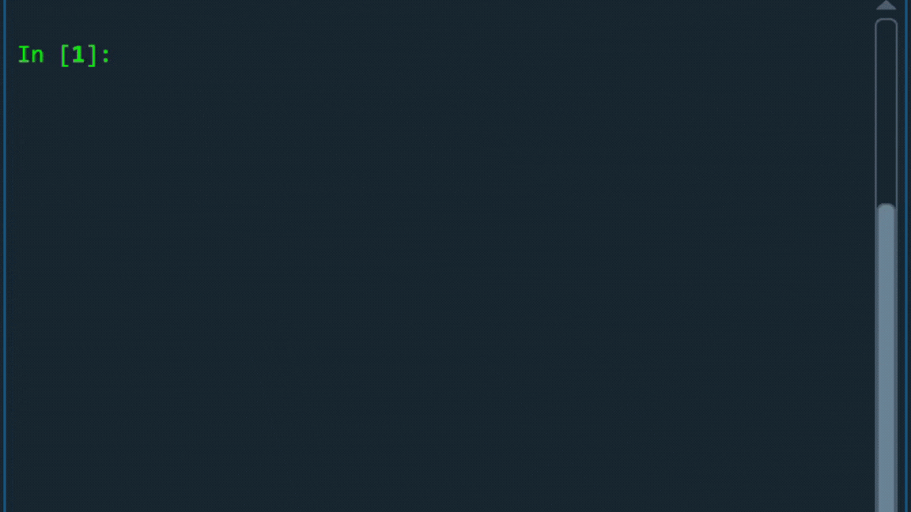

# Password-Generator

## Description
A versatile password generator that creates secure, random passwords based on user-defined criteria, including length and character types. Features include clipboard copying and password strength validatation
## Table of Contents
- [Features](#features)
- [Installation](#installation)
- [Usage](#usage)
- [Security Considerations](#security-considerations)
- [Contributing](#contributing)
- [License](#license)
## Features
- Generate strong passwords with customizable length and character types.
- Validate password strength based on defined criteria.
- Copy generated passwords to the clipboard.
## Installation
1. Clone the repository:
   ```bash
   git clone https://github.com/mkoramoa/password-generator.git
   cd password-generator

2. Install the required packages:
   ```bash
    pip install -r requirements.txt
## Usage
- To run the password generator from the command line:
  ```bash
   python password_generator.py
- The user is prompted with entering a length for the password. Once the minimum length has been entered, the user is then prompted for a choice of character types within the password. The password is then generated and copied onto the clipboard for use by the user. Here is a short clip of how it looks like:
  

## Security Considerations
- It is important that sensitive data is not logged.
- Passwords are copied to the clipboard; Copied passwords are automatically cleared after a specific time. In this project, it is cleared after 30 seconds:
  
## Upcoming Improvements
- Adding created passwords into an encrypted CSV file for easy access and storage.
- Adding API node to the project
- Adding a user interface to improve usability
## Contributing
Contributions are welcome! Please open an issue or create a pull request to contribute to this project.
## License
This project is licensed under the MIT License - see the [LICENSE](LICENSE) file for details.
